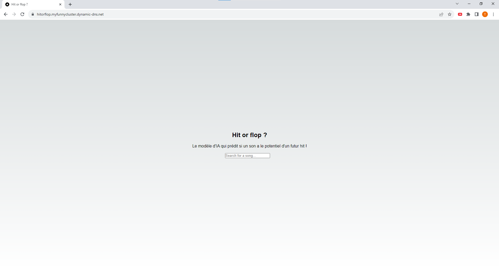

# Hit or Flop 🎵

A production-ready AI system that uses convolutional neural networks to predict whether a song has the characteristics of a hit or a flop.

## 🚀 Features

- Real-time song prediction using Spotify's track data
- Interactive web interface
- Integration with Spotify's API
- Containerized application using Docker
- Neural network model trained on historical hit data

## 🔍 How It Works

The system analyzes various musical features of a track (such as danceability, energy, tempo, etc.) using Spotify's audio features API and processes them through our trained neural network to predict its hit potential.

## 🎯 Demo

### Homepage

## 🛠️ Tech Stack

- **Frontend**: React, TypeScript, Tailwind CSS
- **Backend**: Python, FastAPI
- **AI Model**: TensorFlow, Keras
- **Infrastructure**: Docker, Docker Compose

## 📝 Model Training

The neural network model was trained using a comprehensive dataset of historical music data. You can find the training notebook and methodology on Kaggle:
[Spotify Hit or Flop Training Notebook](https://www.kaggle.com/code/alanjumeaucourt/spotify-hit-or-flop)

## 🚀 Getting Started

1. Clone the repository
2. Create a `.env` file with your Spotify API credentials
3. Run with Docker Compose:
