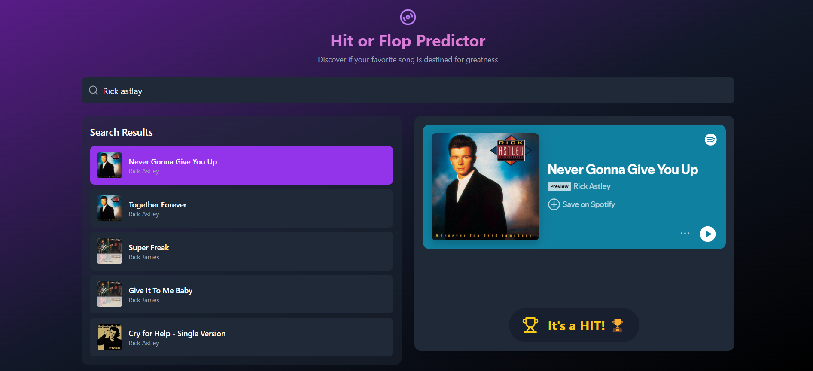

# Hit or flop

This project is the production ready IA that use convolutional neural network to find if a tracks have the caracteristic of a hit or a flop

The notebook that contain the step to train the model can be run found on the kaggle website at https://www.kaggle.com/code/alanjumeaucourt/spotify-hit-or-flop

## Homepage

## Homepage when you select a song

